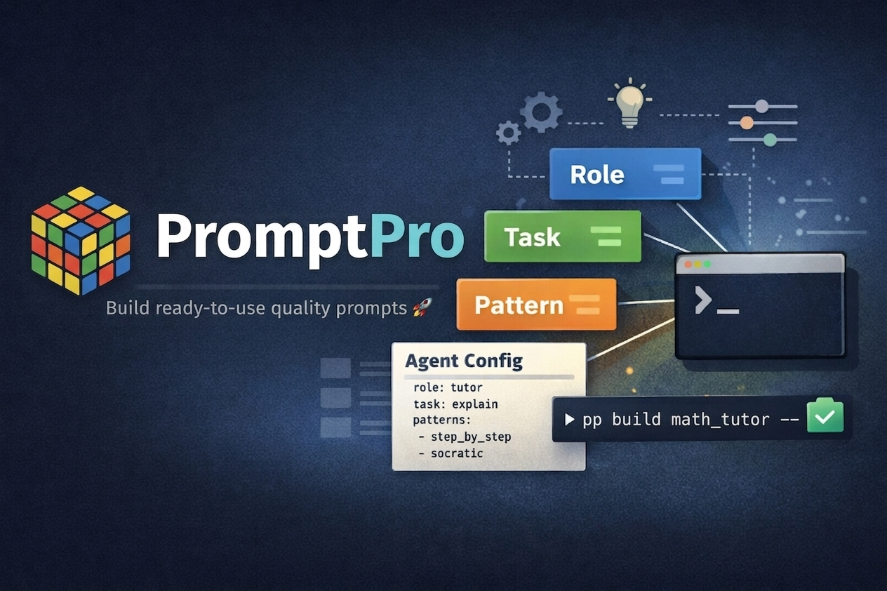

# PromptPro 🎯


<p align="center">
  
</p>

<p align="center">
  <strong>A control plane for composable AI prompting</strong>
</p>

## 📖 Overview

Create ready-to-use, high-quality prompts with a single command 🚀

PromptPro is a modular CLI for composing, managing, and orchestrating reusable AI prompt components.

Instead of storing static snippets, PromptPro treats prompts as structured building blocks — roles, tasks, content, reasoning patterns, and controls — that can be assembled, parameterized, and reused across projects.

Designed for users who think in systems, not snippets.

✨ Why Prompt Pro?

- 🧱 Modular prompt components
- 🤖 Agent presets
- 🧠 Role + task + pattern composition
- 🧩 Variable injection
- 🎛 Fine-grained prompt controls
- 📋 Clipboard export
- 💻 Terminal-native workflow
- 🗂 Version-controlled prompts
- 🔌 Integrations: pipelines, Bash, Python & more

## 📥 Quick Install

### Install With uv (Auto Python Setup)

```shell

# 1. Install uv (if not installed)

# Linux / macOS
curl -Ls https://astral.sh/uv/install.sh | sh

# Windows (PowerShell)
powershell -ExecutionPolicy ByPass -c "irm https://astral.sh/uv/install.ps1 | iex"

# 2. Clone the repository
git clone https://github.com/estebantechdev/prompt-pro.git

# 3. Enter the project directory
cd prompt-pro

# 4. (Optional) Let uv install a compatible Python version automatically
# This will install and use a supported version (e.g., 3.11 or 3.12)
uv python install

# 5. Sync dependencies (creates .venv and installs everything)
uv sync

# 6. Run PromptPro
uv run pp --help

# Example usage
uv run pp list roles

# Optional: install as a global CLI tool
uv tool install .

# Then you can run:
pp --help

```

> [!IMPORTANT]
> If you encounter: *"env: 'python3': No such file or directory"*, ensure the first line of `main.py` is:
>
> ```bash
> #!/usr/bin/env python
> ```

> [!IMPORTANT]
> Clipboard features on Linux require external tools.  
> Install `xsel` or `xclip` using your system package manager.  
> On Wayland-based systems, you may need `wl-clipboard`.

### More Installation Methods

🔗 [More Installation Methods](assets/docs/more_installation_methods.md)

## 🧪 Usage Examples

### Listing Prompt Components

#### Roles

List available roles:

```bash
pp list roles
```

Filter results using multiple patterns (`te` or `utor`):

```bash
pp list roles | grep -E 'te|utor'
```

Example output:

```text
technical_instructor
tutor
```

> [!NOTE]
> The `list` command can also be used with other parameters:
> - `agents`
> - `content`
> - `controls`
> - `pattern_groups`
> - `patterns`
> - `tasks`

### Workflows

PromptPro supports two workflows:
- `build` generates a prompt using a predefined **agent preset**.
  
- `compose` generates a prompt by manually combining **role**, **task**, and **pattern** components.

**controls** and **content** are optional components and can be included as needed—they are not required.

### Creating A Prompt With `build`

Create a prompt using a predefined **agent**:

```bash
pp build math_tutor --var input="Explain recursion"
```

Copy the generated prompt directly to the **clipboard**:

```bash
pp build math_tutor --var input="Explain recursion" --copy
```

### `compose` A Prompt From Components

Compose a prompt by combining a `role`, `task`, and `pattern`:

```bash
pp compose \
  --role tutor \
  --task explain \
  --pattern step_by_step \
  --var input="Boolean algebra simplification"
```

Including multiple patterns and variables:

```bash
pp compose \
  --role tutor \
  --task explain \
  --pattern socratic \
  --pattern step_by_step \
  --var input="Gravity" \
  --var theorist="Albert Einstein"
```

> [!NOTE]
> The explanation response from the AI model used will vary depending on the selected `theorist`. With **Albert Einstein** will frame **"gravity"** as the curvature of spacetime; with **Isaac Newton** will describe gravity as a force acting between masses.
>
> The variable `theorist` does not exist in the built-in version of the task `explain`. It has been introduced intentionally for this example to demonstrate how custom variables can modify and enrich a prompt’s behavior.

> [!TIP]
If you do not need to create additional `--var` variables such as `theorist`, you can embed the context directly in the input parameter:
>
> ```bash
> pp compose --role tutor --task explain --pattern socratic --pattern step_by_step --var input="Gravity, by Isaac Newton" --copy
> ```

## 💉 Using `--var` Variables

To inject dynamic values into your prompt, the template must reference them using *Jinja* syntax.

Your **task file** (inside `tasks/`) must include at least one variable placeholder. For example:

```django
{{ input }}
```

The variable name in the template must match the key used in the command line.

For example, **{{ input }}** in the template corresponds to the `input` variable passed via the CLI.

> [!NOTE]
> If you omit the `--var` parameter, the prompt will be generated without injected values. This allows you to preview, copy, or reuse the base prompt structure independently.

## 📁 Variable Sources

PromptPro supports three types of variable sources:

### 1. Literal Variables (--var)

Use `--var` to pass simple key-value pairs directly from the command line.

```bash
pp compose \
  --role tutor \
  --task explain \
  --pattern socratic \
  --var input="Random text"
```

> [!NOTE]
> * Format must be key=value
> * Values are treated as plain text
> * Best suited for short inputs or dynamic values

### 2. Single File (--var-file)

Use `--var-file` to load the value of a variable from a file instead of passing it inline.

The entire file content is injected as the variable value, making this ideal for larger inputs such as articles, datasets, or structured prompts.

**Example**

```bash
pp compose \
  --role tutor \
  --task explain \
  --pattern socratic \
  --var-file input=content/puzzle.md
```

> [!NOTE]
> Supported file formats include `.md`, `.txt`, and extensionless (plain text) files.
> Only `.md` files are listed when using `pp list`.

You can omit the extension:

```bash
--var-file input=content/<category>/<file>
```

> [!TIP]
> Store your files under `content/` to reference them by name without specifying full paths and keep all your prompt components in one place.

**Path resolution**

`--var-file` resolves file paths by first checking the provided path as-is relative to the current working directory, automatically trying `.md` and `.txt` extensions if none are specified; if not found, it attempts to resolve the path relative to the project root (`BASE_DIR`) using the same extension fallback; finally, it performs a recursive search within the `content/` directory, matching files by exact name or by name without extension (limited to `.md`, `.txt`, or no extension).

### 3. Recursive Directory (--var-dir)

Use `--var-dir` to load and combine the contents of all files in a directory.

All files are read recursively and concatenated into a single variable.

**Example**

```bash
pp compose \
  --role tutor \
  --task explain \
  --pattern socratic \
  --var-dir input=content \
  --copy
```

> [!CAUTION]
> Using `--var-dir` on very large directories can produce a combined variable that exceeds your AI model's *context window*, which may cause truncation or errors. Consider limiting the number or size of files loaded.
> ```bash
> --var-dir input=content/<category>/<sub-category>/
> ```

> [!TIP]
> Store your files under `content/` to reference them by name without specifying full paths and keep all your prompt components in one place.

**File filtering**

Only `.md` and `.txt` files are included when loading directory contents. Hidden files (such as `.DS_Store`) and any unsupported file types are ignored during the process.

**Path resolution**

`--var-dir` resolves directory paths by first checking the provided path as-is relative to the current working directory; if not found, it attempts to resolve the path relative to the project root (`BASE_DIR`). Once resolved, it recursively loads all `.md` and `.txt` files within the directory (ignoring hidden files) and concatenates their contents into a single value separated by blank lines. No additional recursive lookup is performed if the directory is not found.

### Combining All Variable Sources

You can combine multiple variable sources in the same command:

```bash
pp compose \
  --role tutor \
  --task explain \
  --pattern didactic \
  --var input="Random text" \
  --var-file input2=./content/puzzle.md \
  --var-dir input3=./content \
  --copy
```

This allows complex prompt construction from multiple sources.

> [!NOTE]
The variables `input2` and `input3` don't exist in the built-in version of the task `explain`.

#### ⚠️ Variable Overwriting Behavior

> [!IMPORTANT]
> If the same variable name is used multiple times, the **last processed value overrides previous ones**.
> * Processing order: `--var` → `--var-file` → `--var-dir`

**Example**

```bash
pp compose \
  --role tutor \
  --task explain \
  --pattern didactic \
  --var input="Random text" \
  --var-file input=./content/puzzle.md \
  --var-dir input=./content \
  --copy
```

> [!TIP]
> ✔ Use unique variable names whenever possible.  
> ✔ Declare expected variables clearly in your task templates.  
> ✔ Reuse variable names only when intentional overwriting is desired.

## 💾 Save Prompts

You can redirect the output of the command to an external file if you want to save or reuse the generated prompt.

**Examples**

```bash
pp build math_tutor --var input="Explain recursion" > my_prompt.txt
```

```bash
pp compose \
  --role tutor \
  --task explain \
  --pattern didactic \
  --var input="Random text" \
  --var-file input=./content/puzzle.md \
  --var-dir input=./content \
  > my_prompt.txt
```

View the saved prompt:

```bash
cat /path/to/my_prompt.txt
```

## ⚙️ Types Of Tasks

PromptPro provides two built-in, generic task types: `explain` and `action`, which together cover most AI–human interaction scenarios.

▶️ Action — Start / Run the task and produce a result.  
💬 Explain — Describe the reasoning without performing any tasks.

We introduced the `explain` task in the previous examples. Now it's time to look at a couple of examples using the action task.

### Creating Action Prompts With `build`

To create an action prompt with `build`, you must use the built-in `action_agent` agent and pass a **single variable** named `action` as a command parameter. This variable maps directly to the built-in task `action`. The entire **action content** must be **provided** as the value of `action` after the `=` sign.

**Example**

```bash
pp build action_agent --var action="Make a shopping list"
```

> [!TIP]
> Quickly filter the list of available agents:
> ```bash
> pp list agents | grep action
> ```

> [!TIP]
> View the full definition of a specific agent:
> ```bash
> pp show agents/action_agent
> ```

> [!TIP]
> Start from the `action_agent` file when creating new `action` agents, such as `software_tester`.  
> See later sections for advanced usage.

### Creating Action Prompts With `compose`

To create an action prompt with `compose`, you must use the built-in `executor` role and pass a **single task** named `compose_action` in the command parameters. The **action content** must be **defined** through the `action` variable, while `context` and `examples` remain optional but are strongly recommended to improve output quality.

The following example demonstrates how `context` and `examples` can guide an AI language model to better understand the request and generate more accurate, reliable results:

```bash
pp compose \
  --role executor \
  --task compose_action \
  --pattern verify_before_execute \
  --pattern plan_execute \
  --pattern structured_output \
  --var action="Make a shopping list" \
  --var context="I am at the computer store" \
  --var examples="|Item |Brand |Price | |Mouse |Genius |$45.75 |"
```

> [!TIP]
> List available categories and components:
> ```bash
> # List main categories
> pp show prompts
>
> # List a category
> # pp list <category>
> pp list roles
>
> # List a subcategory
> # pp list <category>/<subcategory>
> pp list content/dev
> ```

> [!TIP]
> View the full definition of a specific component:
> ```bash
> # pp show <category>/<component>
> pp show roles/executor
> pp list content/dev/testing
> ```

> [!TIP]
> Use the provided example as a starting point when creating new `action` prompts with `compose`.  
> See later sections for advanced features, such as using `controls`.

## 📘 Tutorials

### 🧱 Creating Prompt Components

Want a step-by-step guide to creating new **agents**, **roles**, **tasks**, and **patterns**?

🔗 [Creating And Using New Prompt Components](assets/docs/creating_new_prompt_components.md)

Complete tutorial on how to create and use a **pattern group**.

🔗 [Creating And Using Pattern Groups](assets/docs/create_and_use_a_pattern_group.md)

### 🎛 Prompt Control Layers

Understand how PromptPro separates **execution control** from **output behavior**:

🔗 [Prompt Control Layers](assets/docs/prompt_control_layers.md)

## 🗂 References

### 🧱 Prompt Components

The `prompts` directory contains the core building blocks for creating prompts in PromptPro, organized into subdirectories that represent specific component types such as roles, tasks, patterns, and agent presets.

🔗 [Prompt Components Reference](assets/docs/prompt_components_reference.md)

### 🧾 YAML Configuration
Learn how to define agent presets and pattern groups using YAML files, including syntax, structure, and best practices.

🔗 [YAML Files Configuration](assets/docs/yaml_file_configuration.md)

### 💻 Command Reference

For a complete list of available commands and quick CLI examples:

🔗 [Command Usage](assets/docs/command_usage.md)

### 🧠 Concepts

Understanding modern prompting frameworks helps you use PromptPro more effectively.

🔗 [The Iceberg Of Prompting](assets/docs/the_iceberg_of_prompting.md)

A quick reference for key terminology used across PromptPro.

🔗 [Glossary Of Terms](assets/docs/glossary.md)

## 🔌 Integrations

### ⚡ Pipelines

PromptPro outputs plain text, which means it integrates naturally with the Unix philosophy of **small tools connected by pipes**.

This allows prompts to flow directly into other programs such as AI models, speech engines, desktop tools, APIs, and automation scripts.

**Example**

```bash
pp build math_tutor --var input="Explain recursion" \
| ollama run llama3 \
| espeak-ng
```

Pipeline flow:

* PromptPro → LLM → speech synthesis

For more examples and integrations with tools such as curl, pandoc, zenity, and netcat, see:
🔗 [Prompt Pipelines](assets/docs/prompt_pipelines.md).

### 🐚 Bash Scripting

PromptPro integrates easily with shell scripts and command-line automation.

Because Bash expands variables before executing a command, you can dynamically construct prompts using variables or command outputs.

**Example**

```bash
topic="recursion"
language="Python"

pp build math_tutor --var input="Explain ${topic} in ${language}"
```

PromptPro can also consume values from other commands or scripts, making it ideal for automation pipelines.

For more examples using Bash variables, command substitution, and scripting patterns, see: 🔗 [Using Bash Variables With PromptPro](assets/docs/bash_variables.md).

### 🐍 Python Integration

PromptPro can be used seamlessly inside Python scripts, enabling automation, testing, and integration with larger applications.

**Example**

```python
import subprocess


def test_pp_list_roles():
    result = subprocess.run(
        ["pp", "list", "roles"],
        capture_output=True,
        text=True
    )

    assert result.returncode == 0, "Command failed"
    assert result.stdout.strip() != "", "No output returned"

    print(result.stdout)


if __name__ == "__main__":
    test_pp_list_roles()
```

To run the script:

```py
python test.py
```

🔗 [More Examples With Python](assets/docs/python_integration.md).

## 🤝 Contributions

Contributions are highly encouraged — especially new prompt components.

You can contribute:

- New **roles** (teaching styles, expert personas, system behaviors)
- New **tasks** (analysis, critique, summarization, transformation, etc.)
- New **patterns** (reasoning frameworks, output formats, cognitive constraints)
- New **pattern groups** (reusable bundles that combine multiple patterns into higher-level behavioral modes)
- New **agent presets** that combine existing components
- Documentation improvements and examples

PromptPro becomes more powerful as its library of components grows.

If you’ve built something reusable, open a pull request and help expand the ecosystem.

## 📜 License

This project is licensed under the [GPL-3.0](LICENSE) - see the [LICENSE](LICENSE) file for details.
