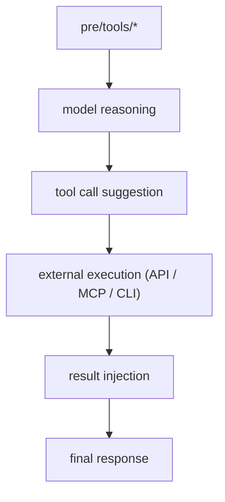
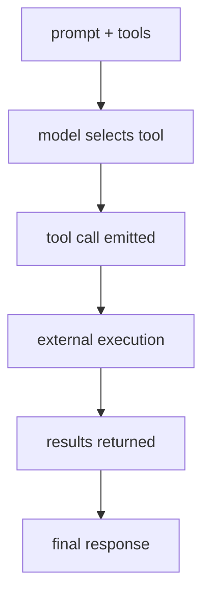
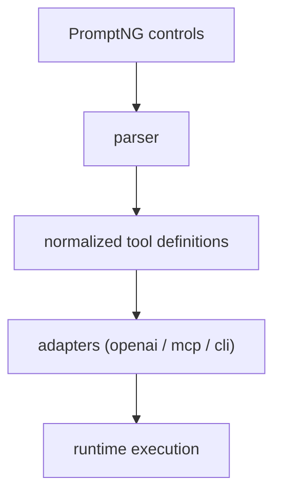

# Prompt Controls In Agentic Systems

This document defines how PromptNG enables **agentic behavior through prompt controls**, with a focus on tooling execution and external system interaction.

PromptNG treats prompts as **structured control surfaces** that can drive execution across multiple runtimes.

## Tooling Execution Capabilities

PromptNG supports models with **tooling (function) execution** capabilities by exposing tools through structured prompt controls.

This enables models to:

* Decide when external data or actions are required

* Produce structured tool calls

* Integrate results into final responses

Execution is handled externally. The model acts as a **decision layer**, not an execution engine.

### What This Enables

PromptNG can drive:

* MCP endpoints

* External APIs

* Internal functions

* CLI commands

All of these are exposed as **tools with defined interfaces**.

## MCPs VS Tools VS CLIs

PromptNG normalizes all execution mechanisms into a single abstraction: **tools**.

| Concept | Interpretation                     |
| ------- | ---------------------------------- |
| MCP     | Tool provider interface            |
| Tool    | Callable function                  |
| CLI     | Executable command wrapped as tool |

All are defined using the same structure and exposed through:

```bash
/path/to/promptng/controls/pre/tools/*
```

> [!NOTE]
> Prompt `controls` are optional when designing prompts and may be delegated to the **agentic system** when supported.

## PromptNG And Agentic Systems

PromptNG is designed for agentic systems that support:

* Tool calling

* Multi-step workflows

* External execution

It allows:

* Behavior to be modified via prompts

* Tools to be dynamically injected

* Execution flows to be controlled declaratively

PromptNG is adaptable to future **AGI-oriented architectures**.

## Triggering Execution Through Prompting

PromptNG enables execution through structured controls.

A prompt can:

* Declare tools

* Define when they should be used

The model can then:

* Select a tool

* Generate valid parameters

* Request execution

### Execution Flow



## Built-in Controls: System-Agnostic Design

PromptNG built-in controls are:

* Generic

* Portable

* Runtime-independent

They are not tied to specific systems such as:

* Claude Code

* Codex

* Qwen Code

* GitHub Copilot

### 🛠️ Tooling & External Execution

Here is an example illustrating a portable 🔗 [tool specification](./prompts/controls/built-in_controls.md#control-pretoolsweblookup) that can drive real agent systems across multiple runtimes.

## Tool Calling In AI Models

AI models support external interaction through **tool calling** (function calling), enabling access to external data and execution of operations within workflows.

The model does not execute tools directly. It produces structured calls that are executed by the runtime.

## AI Models Supporting Tool Calling

This list includes representative models known to support tool calling. It is not exhaustive and may become outdated as new models and versions are released.

* Anthropic Claude (Opus 4.6, Sonnet 4.5/4.6)

* OpenAI GPT-5 (5.4)

* Google Gemini (3 Flash, 3 Pro)

* Alibaba Qwen (Qwen 2.5, Qwen 2.5-Max)

* Xiaomi MiMo-V2-Pro

* DeepSeek-V3

* NVIDIA Nemotron 3 Super

## Tool Calling Process



## Agentic Frameworks And Standards

* Model Context Protocol (MCP) → tool interface layer

* OpenRouter → multi-model routing

* LangChain / LangGraph → orchestration layer

### Integration Pipeline



## 🔐 Security Considerations

* Validate and sanitize tool inputs

* Restrict access to sensitive systems

## 🔄 Execution Notes

* External tools may introduce latency

* Results may vary depending on availability

## Final Perspective

PromptNG defines a model where:

* Prompt `controls` are **control systems**

* Tools are **execution interfaces**

* Models are **decision engines**

This enables consistent and portable agentic behavior across runtimes.
