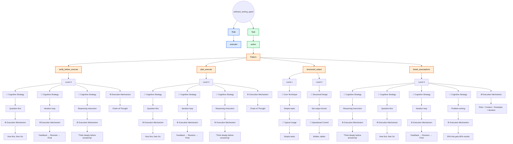
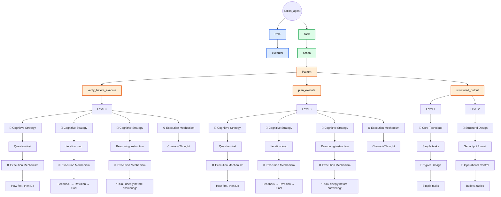
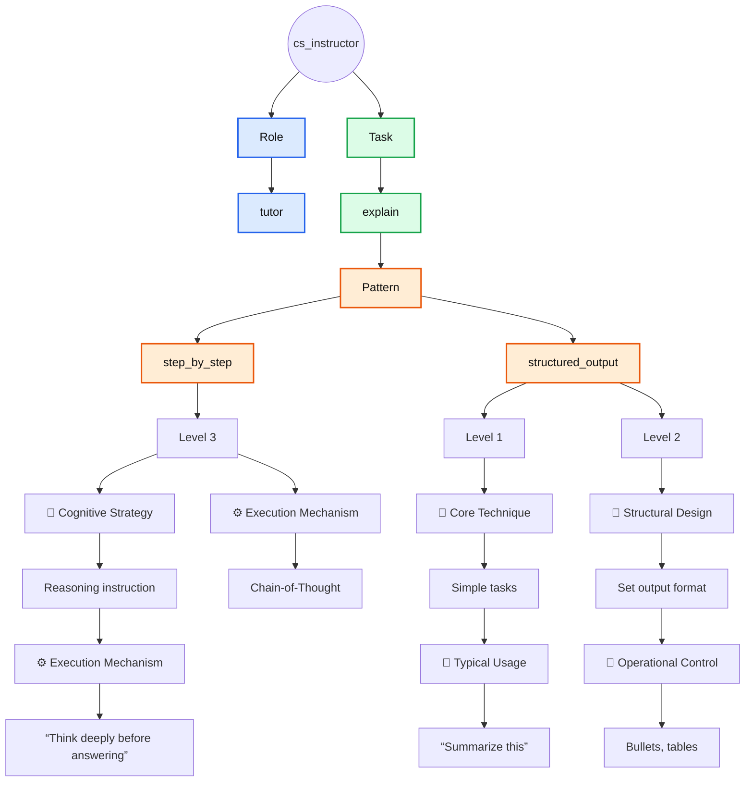
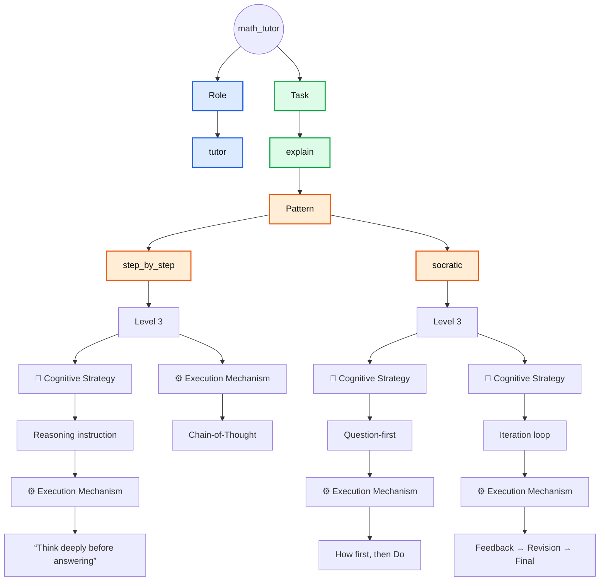

# Built-in Agents

Reference implementations of built-in agents designed around different
functional focuses and reasoning patterns.

> [!IMPORTANT]
> **Built-in Agents** are organized by their primary area of focus, which guides how they approach tasks and structure their reasoning. While each built-in agent is designed with a particular focus in mind, they remain capable of assisting with requests beyond that scope when needed.

> [!NOTE]
> Table columns that follow **Pattern** represent matches with corresponding elements in [The Iceberg Of Prompting](../../the_iceberg_of_prompting.md) framework.

## Agent: `software_testing_agent`

### Description

(Desc)

### Specification Table

| Role            | Task   | Pattern               | 🧠 Cognitive Strategy | ⚙️ Execution Mechanism          |
|-----------------|--------|-----------------------|-----------------------|---------------------------------|
| software_tester | action | verify_before_execute | Question-first        | How first, then Do              |
| software_tester | action | verify_before_execute | Iteration loop        | Feedback → Revision → Final     |
| software_tester | action | verify_before_execute | Reasoning instruction | “Think deeply before answering” |
| software_tester | action | verify_before_execute | —                     | Chain-of-Thought                |
| software_tester | action | plan_execute          | Question-first        | How first, then Do              |
| software_tester | action | plan_execute          | Iteration loop        | Feedback → Revision → Final     |
| software_tester | action | plan_execute          | Reasoning instruction | “Think deeply before answering” |
| software_tester | action | plan_execute          | —                     | Chain-of-Thought                |

| Role            | Task   | Pattern           | 🧩 Core Technique | 🎯 Typical Usage |
|-----------------|--------|-------------------|-------------------|------------------|
| software_tester | action | structured_output |Simple tasks       |“Summarize this”  |

| Role            | Task   | Pattern           | 📐 Structural Design | 🚦 Operational Control |
|-----------------|--------|-------------------|----------------------|------------------------|
| software_tester | action | structured_output |Set output format     |Bullets, tables         |

| Role            | Task   | Pattern           | 🧠 Cognitive Strategy | ⚙️ Execution Mechanism                |
|-----------------|--------|-------------------|-----------------------|---------------------------------------|
| software_tester | action | break_assumptions | Reasoning instruction | “Think deeply before answering”       |
| software_tester | action | break_assumptions | Question-first        | How first, then Do                    |
| software_tester | action | break_assumptions | Iteration loop        | Feedback → Revision → Final           |
| software_tester | action | break_assumptions | Problem-solving       | 20% that gets 80% results             |
| software_tester | action | break_assumptions | -                     | Role + Context + Examples + Iteration |

### Flowchart



### List And Show

```bash
pp list agents/dev | grep test
pp show agents/dev/software_testing_agent
```

### Usage

```bash
pp build dev/software_testing_agent --var action="<action>"
```

### Example

```bash
pp build dev/software_testing_agent --var-file action=content/dev/testing/boundary_edge_cases
```

## Agent: `action_agent`

### Description

An execution-focused agent designed to perform tasks by verifying requirements or planning before acting, using reasoning strategies and structured outputs to ensure accurate and controlled results.

### Specification Table

| Role                 | Task     | Pattern               | 🧠 Cognitive Strategy | ⚙️ Execution Mechanism          |
|----------------------|----------|-----------------------|-----------------------|---------------------------------|
| executor             | action   | verify_before_execute | Question-first        | How first, then Do              |
| executor             | action   | verify_before_execute | Iteration loop        | Feedback → Revision → Final     |
| executor             | action   | verify_before_execute | Reasoning instruction | “Think deeply before answering” |
| executor             | action   | verify_before_execute | —                     | Chain-of-Thought                |
| executor             | action   | plan_execute          | Question-first        | How first, then Do              |
| executor             | action   | plan_execute          | Iteration loop        | Feedback → Revision → Final     |
| executor             | action   | plan_execute          | Reasoning instruction | “Think deeply before answering” |
| executor             | action   | plan_execute          | —                     | Chain-of-Thought                |

| Role                 | Task    | Pattern           | 🧩 Core Technique     | 🎯 Typical Usage                |
|----------------------|---------|-------------------|-----------------------|---------------------------------|
| executor             | action  | structured_output |Simple tasks           |“Summarize this”                 |

| Role                 | Task    | Pattern           | 📐 Structural Design  | 🚦 Operational Control          |
|----------------------|---------|-------------------|-----------------------|---------------------------------|
| executor             | action  | structured_output |Set output format      |Bullets, tables                  |

### Flowchart



### List And Show

```bash
pp list agents | grep action
pp show agents/action_agent
```

### Usage

```bash
pp build action_agent --var action="<action>"
```

### Example

```bash
pp build action_agent --var action="Make a shopping list" --copy
```

## Agents: `action_agent_controlled`

### Description

An execution-focused agent designed to perform tasks by verifying requirements or planning before acting, using reasoning strategies and structured outputs to ensure accurate and controlled results.

It has all the `action_agent` features plus an only `pre` prompt control `forget` used as example.

For more information about the `forget` memory pre control, click 🔗 [here](../controls/built-in_controls.md#control-memoryforget).

### List And Show

```bash
pp list agents | grep action
pp show agents/action_agent_controlled
```

### Usage

```bash
pp build action_agent_controlled --var action="<action>"
```

### Example

```bash
pp build action_agent_controlled --post truth/say_dont_know --var action="Make a list of the core skills everyone should have."
```

## Agent: `cs_instructor`

### Description

A technical teaching agent specialized in explaining computer science concepts step by step, using reasoning strategies and structured outputs to make complex topics easier to understand.

### Specification Table

| Role                 | Task    | Pattern           | 🧠 Cognitive Strategy | ⚙️ Execution Mechanism          |
|----------------------|---------|-------------------|-----------------------|---------------------------------|
| technical_instructor | explain | step_by_step      | Reasoning instruction | “Think deeply before answering” |
| technical_instructor | explain | step_by_step      | —                     | Chain-of-Thought                |

| Role                 | Task    | Pattern           | 🧩 Core Technique     | 🎯 Typical Usage                |
|----------------------|---------|-------------------|-----------------------|---------------------------------|
| technical_instructor | explain | structured_output |Simple tasks           |“Summarize this”                 |

| Role                 | Task    | Pattern           | 📐 Structural Design  | 🚦 Operational Control          |
|----------------------|---------|-------------------|-----------------------|---------------------------------|
| technical_instructor | explain | structured_output |Set output format      |Bullets, tables                  |

### Flowchart



### List And Show

```bash
pp list agents | grep instructor
pp show agents/cs_instructor
```

### Usage

```bash
pp build cs_instructor --var input="<input>"
```

### Example

```bash
pp build cs_instructor --var input="Switch, explained for beginners" --copy
```

## Agent: `math_tutor`

### Description

An educational agent that teaches mathematical concepts through step-by-step explanations and Socratic questioning, encouraging reasoning and iterative understanding.

### Specification Table

| Role  | Task    | Pattern        | 🧠 Cognitive Strategy | ⚙️ Execution Mechanism            |
|-------|---------|----------------|-----------------------|-----------------------------------|
| tutor | explain | step_by_step   | Reasoning instruction | “Think deeply before answering”   |
| tutor | explain | step_by_step   | —                     | Chain-of-Thought                  |
| tutor | explain | socratic       | Question-first        | How first, then Do                |
| tutor | explain | socratic       | Iteration loop        | Feedback → Revision → Final       |

### Flowchart



### List And Show

```bash
pp list agents | grep math
pp show agents/math_tutor
```

### Usage

```bash
pp build math_tutor --var input="<input>"
```

### Example

```bash
pp build math_tutor --var input="Explain recursion" --copy
```
