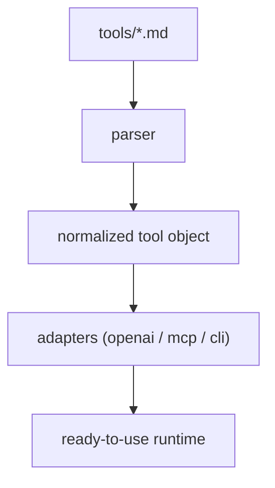

# Detailed Specification For `pre`/`tools`/`web`/`lookup` Control

This document defines a **canonical version** of the web lookup tool.

`lookup.md` is a complete, production-ready file that works as:

- Human-readable guidance (for the model)  

- Machine-readable (for your parser)  

- Multi-runtime (OpenAI, MCP, CLI, internal)

## When to Use

- When information must be up-to-date

- When external knowledge is required

- When the model lacks confidence

## Design Rationale

This **prompt control** is:

- descriptive enough for LLM reasoning  

- structured enough for programmatic extraction

That balance is what most systems get wrong.

### For the Model

- Clear “when to use”

- Strong behavioral constraints

- Examples improve selection

### For Your Parser

- Multiple **clearly separated blocks**

- JSON is extractable

- CLI template is usable

### For Your Runtime

- OpenAI schema ready

- MCP schema ready

- CLI executable

- Metadata usable for routing/security

## Interfaces

### OpenAI / Gemini (Function Calling)

```json
{
  "name": "web_lookup",
  "description": "Retrieve up-to-date or external information from the web",
  "parameters": {
    "type": "object",
    "properties": {
      "query": {
        "type": "string",
        "description": "Search query"
      }
    },
    "required": ["query"]
  }
}
```

### MCP (Model Context Protocol)

**Example 1: Minimal schema**

```json
{
  "name": "web_lookup",
  "description": "Retrieve up-to-date web data",
  "input_schema": {
    "type": "object",
    "properties": {
      "query": {
        "type": "string",
        "description": "Search query"
      }
    },
    "required": ["query"]
  }
}
```

**Example 2: Extended schema with optional parameters**

```json
{
  "name": "web_lookup",
  "description": "Retrieve up-to-date web data",
  "input_schema": {
    "type": "object",
    "properties": {
      "query": {
        "type": "string",
        "description": "Search query"
      }
      ,
      "options": {
        "type": "object",
        "description": "Optional parameters",
        "additionalProperties": true
      }
    },
    "required": ["query"]
  }
}
```

### CLI (Command-Line Interface)

**Bash: for direct execution**

```bash
web_lookup --query "{query}"
```

**JSON: for structured runners / orchestration systems**

```json
{
  "command": "web_lookup",
  "args": ["--query", "{query}"]
}
```

### Internal Runtime Interface (Python)

```python
def web_lookup(query: str) -> str
```

### Metadata

```json
{
  "name": "web_lookup",
  "category": "web",
  "capabilities": ["read"],
  "risk": "low",
  "latency": "medium",
  "deterministic": false
}
```

## Tool Processing Pipeline



## Agentic System Example

### Overview

The example shows how a single Markdown-based tool specification (like `web_lookup`) can be transformed into a multi-environment runtime system that works across APIs, protocols, and command-line execution.

### How It Works

This agentic system works by treating each tool as a single source of truth defined in Markdown, then automatically transforming that definition into usable formats across different environments. A parser scans each `.md` file, extracts structured blocks like JSON (for APIs) and Bash (for CLI), and normalizes them into a consistent internal representation. This allows the system to understand what each tool does, what inputs it expects, and how it can be executed—without hardcoding any tool logic in the runtime itself.

Once normalized, adapter layers convert the tool into multiple execution interfaces: OpenAI-compatible schemas for LLM function calling, MCP-compatible schemas for agent frameworks, and dynamically generated Python functions for CLI execution. This means the same tool can be invoked by an AI model, an agent protocol, or a local script with no duplication of effort. By simply adding new Markdown files, the system can expand its capabilities, making it highly modular, extensible, and aligned with agent-based architectures.

### Implementation

**tool_runtime.py**

```python
# A Tool Specification Runtime + Adapter Layer for Agent Systems

import re
import json


#-------------------------------------------
# Parser
#-------------------------------------------

# Extract structured blocks from Markdown.
def extract_blocks(md_text):
    blocks = {}

    # JSON blocks
    json_blocks = re.findall(r"```json\n(.*?)```", md_text, re.DOTALL)
    
    # Bash blocks
    bash_blocks = re.findall(r"```bash\n(.*?)```", md_text, re.DOTALL)

    if len(json_blocks) >= 1:
        blocks["openai"] = json.loads(json_blocks[0])

    if len(json_blocks) >= 2:
        blocks["mcp"] = json.loads(json_blocks[1])

    if bash_blocks:
        blocks["cli"] = bash_blocks[0].strip()

    return blocks


#-------------------------------------------
# Normalize Tool Object
#-------------------------------------------

def load_tool(path):
    with open(path) as f:
        md = f.read()

    interfaces = extract_blocks(md)

    return {
        "name": interfaces["openai"]["name"],
        "openai": interfaces.get("openai"),
        "mcp": interfaces.get("mcp"),
        "cli": interfaces.get("cli"),
    }


#-------------------------------------------
# Adapter Generators
#-------------------------------------------

# OpenAI Adapter
def build_openai_tools(tools):
    return [tool["openai"] for tool in tools if tool.get("openai")]

# MCP Adapter
def build_mcp_tools(tools):
    mcp_tools = []

    for tool in tools:
        if tool.get("mcp"):
            mcp_tools.append({
                "name": tool["mcp"]["name"],
                "input_schema": tool["mcp"]["input_schema"]
            })

    return mcp_tools

# CLI Adapter (Auto Wrapper)
import subprocess

def build_cli_executor(tools):
    registry = {}

    for tool in tools:
        if not tool.get("cli"):
            continue

        template = tool["cli"]

        def make_func(cmd_template):
            def run(**kwargs):
                cmd = cmd_template

                for k, v in kwargs.items():
                    cmd = cmd.replace(f"{{{k}}}", str(v))

                result = subprocess.run(
                    cmd.split(),
                    capture_output=True,
                    text=True
                )
                return result.stdout

            return run

        registry[tool["name"]] = make_func(template)

    return registry


#-------------------------------------------
# Load Everything
#-------------------------------------------

import glob

tool_files = glob.glob("tools/**/*.md", recursive=True)

tools = [load_tool(f) for f in tool_files]

openai_tools = build_openai_tools(tools)
mcp_tools = build_mcp_tools(tools)
cli_tools = build_cli_executor(tools)

```

### Use It

#### OpenAI

```python
client.responses.create(
    model="gpt-5",
    tools=openai_tools,
    input="Find Costa Rica population"
)
```

#### MCP

```python
mcp_client.register_tools(mcp_tools)
```

#### CLI Runtime

```python
result = cli_tools["web_lookup"](query="Costa Rica population")
```

#### (Optional) Auto-Generate Python Files

You can even generate code:

```python
def generate_cli_file(tool):
    name = tool["name"]

    return f"""
def {name}(**kwargs):
    return cli_registry["{name}"](**kwargs)
"""
```

## 🔐 Security Considerations

- Only allow safe outbound requests

- Sanitize input queries

- Prevent access to restricted endpoints

- Log requests for observability

## 🔄 Execution Notes

- This tool may introduce latency

- Results may vary depending on source availability

- Should be retried on transient failures
