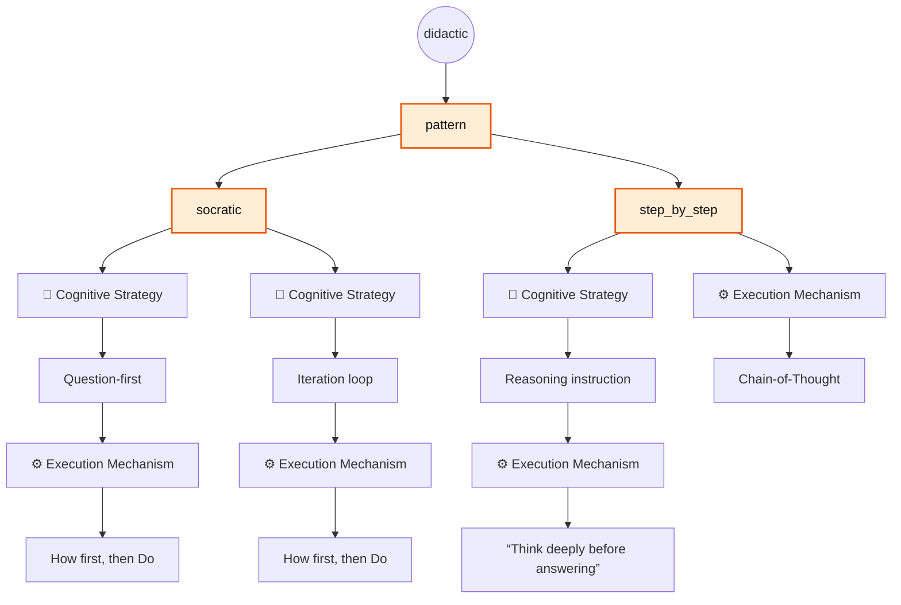
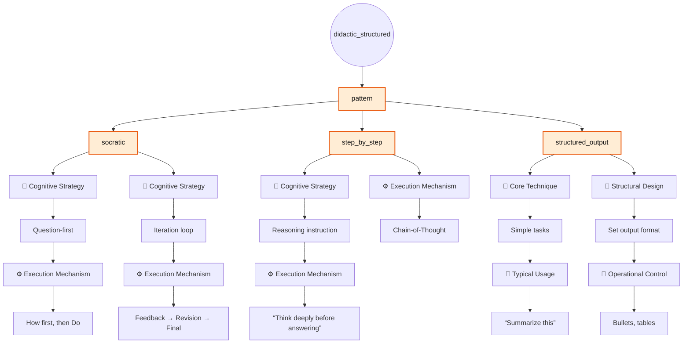
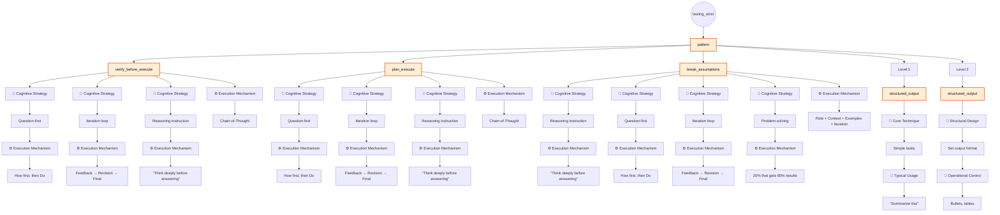

# Built-in Pattern Groups

> [!NOTE]
> Table columns that follow **Pattern** represent matches with corresponding elements in [The Iceberg Of Prompting](../../the_iceberg_of_prompting.md) framework.

## Pattern Group: `didactic`

### Description

Expands into the patterns `socratic` and `step_by_step`.

### Specification Table

| Pattern | 🧠 Cognitive Strategy | ⚙️ Execution Mechanism      |
|---------|-----------------------|-----------------------------|
|socratic | Question-first        | How first, then Do          |
|socratic | Iteration loop        | Feedback → Revision → Final |

| Pattern     | 🧠 Cognitive Strategy | ⚙️ Execution Mechanism           |
|-------------|-----------------------|----------------------------------|
|step_by_step | Reasoning instruction | “Think deeply before answering”  |
|step_by_step | —                     | Chain-of-Thought                 |

### Flowchart



### List And Show

```bash
pp list pattern_groups | grep did
pp show pattern_groups/didactic
```

### Usage

#### Agent Configuration

```yaml
patterns:
  - didactic
```

#### With Compose

```bash
pp compose --role <role> --task <task> --pattern didactic --var input="<input>"
```

### Example

```bash
pp compose --role tutor --task explain --pattern didactic --var input="Binary Search Trees" --copy
```

## Pattern Group: `didactic_structured`

### Description

Expands into the patterns `socratic`, `step_by_step`, and `structured_output`.

### Specification Table

| Pattern | 🧠 Cognitive Strategy | ⚙️ Execution Mechanism      |
|---------|-----------------------|-----------------------------|
|socratic | Question-first        | How first, then Do          |
|socratic | Iteration loop        | Feedback → Revision → Final |

| Pattern     | 🧠 Cognitive Strategy | ⚙️ Execution Mechanism           |
|-------------|-----------------------|----------------------------------|
|step_by_step | Reasoning instruction | “Think deeply before answering”  |
|step_by_step | —                     | Chain-of-Thought                 |

| Pattern           | 🧩 Core Technique     | 🎯 Typical Usage                |
|-------------------|-----------------------|---------------------------------|
| structured_output |Simple tasks           |“Summarize this”                 |

| Pattern           | 📐 Structural Design  | 🚦 Operational Control          |
|-------------------|-----------------------|---------------------------------|
| structured_output |Set output format      |Bullets, tables                  |

### Flowchart



### List And Show

```bash
pp list pattern_groups | grep did
pp show pattern_groups/didactic_structured
```

### Usage

#### Agent Configuration

```yaml
patterns:
  - didactic_structured
```

#### With Compose

```bash
pp compose --role <role> --task <task> --pattern didactic_structured --var input="<input>"
```

### Example

```bash
pp compose --role tutor --task explain --pattern didactic_structured --var input="Binary Search Trees" --copy
```

## Pattern Group: `testing_strict`

### Description

Expands into the patterns `verify_before_execute`, `plan_execute`, `break_assumptions`, and `structured_output`.

### Specification Table

| Pattern               | 🧠 Cognitive Strategy | ⚙️ Execution Mechanism          |
|-----------------------|-----------------------|---------------------------------|
| verify_before_execute | Reasoning instruction | “Think deeply before answering” |
| verify_before_execute | —                     | Chain-of-Thought                |
| verify_before_execute | Question-first        | How first, then Do              |
| verify_before_execute | Iteration loop        | Feedback → Revision → Final     |
| plan_execute          | Reasoning instruction | “Think deeply before answering” |
| plan_execute          | —                     | Chain-of-Thought                |
| plan_execute          | Question-first        | How first, then Do              |
| plan_execute          | Iteration loop        | Feedback → Revision → Final     |

| Pattern           | 🧩 Core Technique | 🎯 Typical Usage |
|-------------------|-------------------|------------------|
| structured_output |Simple tasks       |“Summarize this”  |

| Pattern           | 📐 Structural Design | 🚦 Operational Control |
|-------------------|----------------------|------------------------|
| structured_output |Set output format     |Bullets, tables         |

| Pattern           | 🧠 Cognitive Strategy | ⚙️ Execution Mechanism                |
|-------------------|-----------------------|---------------------------------------|
| break_assumptions | Reasoning instruction | “Think deeply before answering”       |
| break_assumptions | Question-first        | How first, then Do                    |
| break_assumptions | Iteration loop        | Feedback → Revision → Final           |
| break_assumptions | Problem-solving       | 20% that gets 80% results             |
| break_assumptions | -                     | Role + Context + Examples + Iteration |

### Flowchart



### List And Show

```bash
pp list pattern_groups | grep strict
pp show pattern_groups/testing_strict
```

### Usage

#### Agent Configuration

```yaml
patterns:
  - testing_strict
```

#### With Compose

```bash
pp compose --role <role> --task <task> --pattern testing_strict --var input="<input>"
```

### Example

```bash
pp compose --role dev/software_tester --task action --pattern testing_strict --var-file action=content/dev/testing/boundary_edge_cases
```
