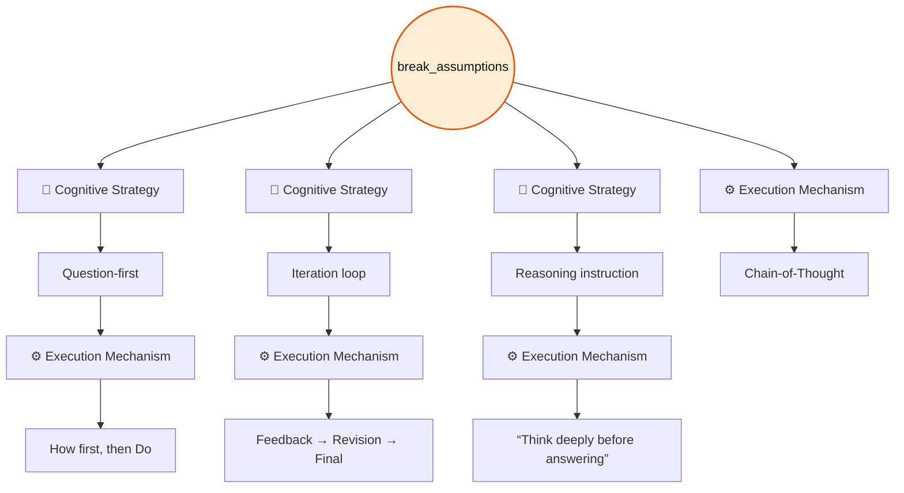
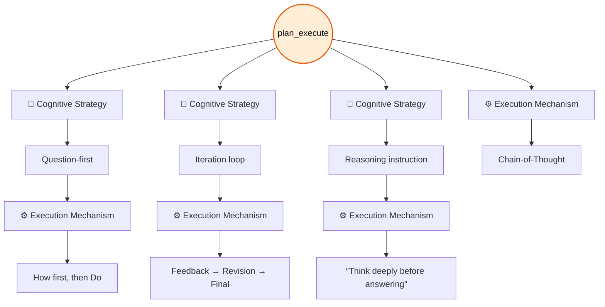
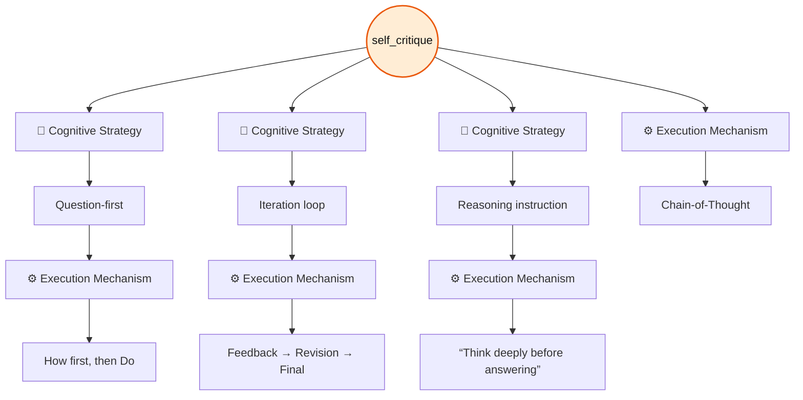
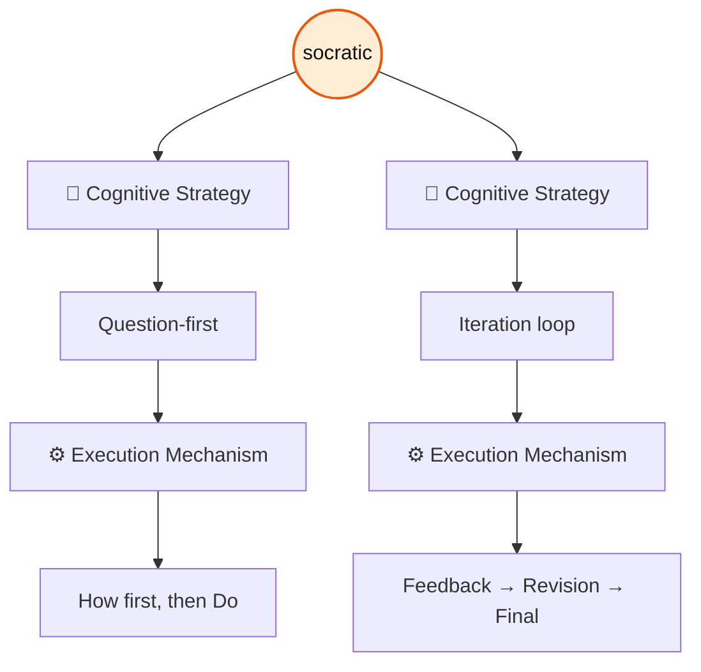
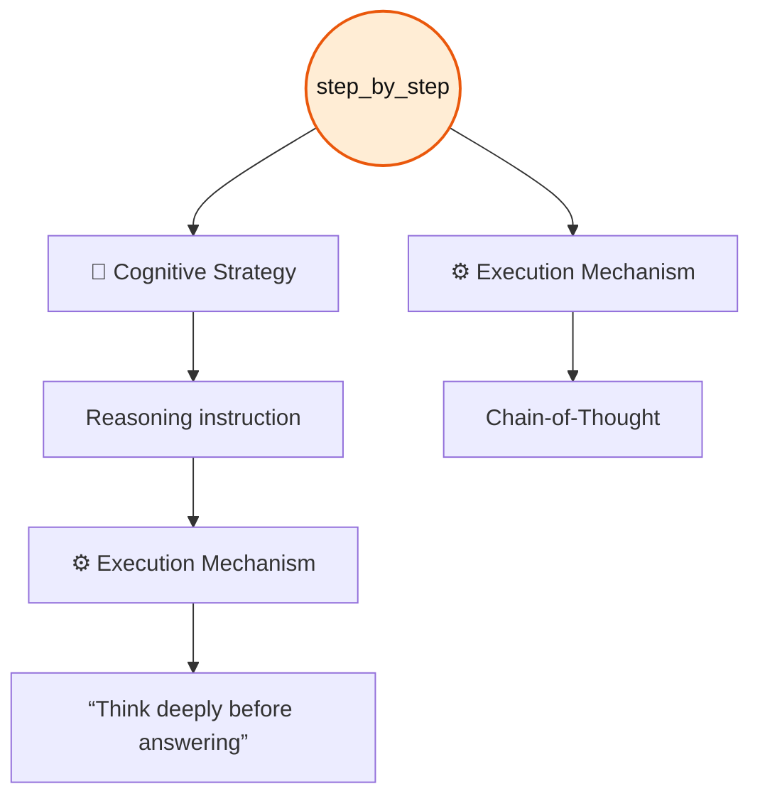
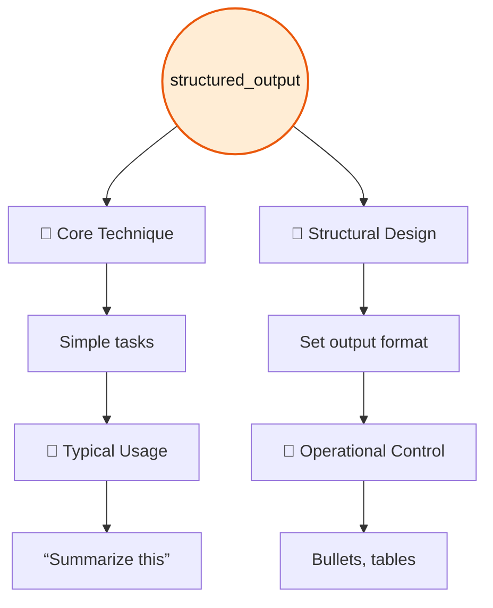
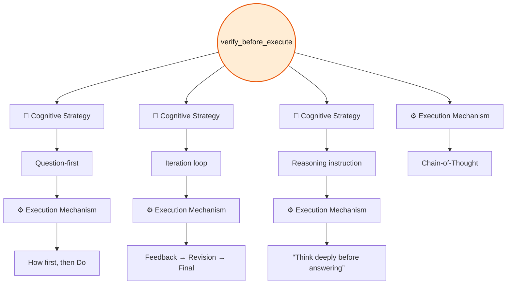

# Built-in Patterns

> [!NOTE]
> Table columns that follow **Pattern** represent matches with corresponding elements in [The Iceberg Of Prompting](../../the_iceberg_of_prompting.md) framework.

## Pattern: `break_assumptions`

### Description

This pattern emphasizes disciplined critical thinking by refusing to take ideas at face value and instead actively questioning underlying assumptions, testing their validity against edge cases and unusual scenarios, and probing for weaknesses or points of failure that might not be immediately obvious; it encourages examining ambiguity from multiple angles, considering alternative interpretations, and stress-testing conclusions to ensure they remain robust under varied conditions rather than relying on surface-level plausibility.

### Specification Table

| Pattern           | 🧠 Cognitive Strategy | ⚙️ Execution Mechanism          |
|-------------------|-----------------------|---------------------------------|
| break_assumptions | Question-first        | How first, then Do              |
| break_assumptions | Iteration loop        | Feedback → Revision → Final     |
| break_assumptions | Reasoning instruction | “Think deeply before answering” |
| break_assumptions | —                     | Chain-of-Thought                |

### Flowchart



### List And Show

```bash
pp list patterns | grep break
pp show patterns/break_assumptions
```

### Usage

#### Agent Configuration

```yaml
patterns:
  - break_assumptions
```

#### With Compose

```bash
pp compose --role <role> --task <task> --pattern break_assumptions --var <key>=<value>"
```

### Examples

**Using the `action` task + an action verb**

```bash
pp compose \
  --role tutor \
  --task action \
  --pattern break_assumptions \
  --var action="Analyze the following statement: Replacing all public buses in a city with self-driving electric shuttles will reduce traffic congestion and pollution."
```

Notice that this command pairs the `tutor` `role` (instead of `executor`) with the `action` `task`, resulting in a response framed from a math tutor’s perspective. This combination is appropriate when it aligns with the intended outcome of the prompt.

**Expanding the pattern group `testing_strict`**

```bash
pp compose \
  --role dev/software_tester \
  --task action \
  --pattern testing_strict \
  --var-file action=content/dev/testing/boundary_edge_cases
```

This command uses the `testing_strict` `pattern_group`, which expands to include the `break_assumptions` `pattern`.

## Pattern: `plan_execute`.

### Description

This pattern instructs the model to first outline a concise sequence of steps required to solve a task and then carry out those steps in order. By separating planning from execution, it improves clarity, organization, and reliability in the final result.

### Specification Table

| Pattern               | 🧠 Cognitive Strategy | ⚙️ Execution Mechanism          |
|-----------------------|-----------------------|---------------------------------|
| plan_execute          | Question-first        | How first, then Do              |
| plan_execute          | Iteration loop        | Feedback → Revision → Final     |
| plan_execute          | Reasoning instruction | “Think deeply before answering” |
| plan_execute          | —                     | Chain-of-Thought                |

### Flowchart



### List And Show

```bash
pp list patterns | grep exec
pp show patterns/plan_execute
```

### Usage

#### Agent Configuration

```yaml
patterns:
  - plan_execute
```

#### With Compose

```bash
pp compose --role <role> --task <task> --pattern plan_execute --var <key>=<value>"
```

### Example

```bash
pp compose \
  --role executor \
  --task compose_action \
  --pattern verify_before_execute \
  --pattern plan_execute \
  --pattern structured_output \
  --var action="Make a shopping list" \
  --var context="I am at the computer store" \
  --var examples="|Item |Brand |Price | |Mouse |Genius |$45.75 |"
```

## Pattern: `self_critique`

### Description

A structured reflection pattern that prompts the model to critically review its own response before finalizing it. It focuses on identifying errors, questioning assumptions, uncovering gaps or unclear areas, and refining the output to improve clarity, accuracy, and overall coherence.

> [!NOTE]
> The `self_critique` pattern already includes a step for identifying and challenging assumptions. However, there is also a dedicated `break_assumptions` pattern that focuses specifically on this aspect.
>
> You can use either pattern independently, or combine them when the prompt requires **deeper analysis** or more **rigorous assumption** testing.
>
> See the **Examples** section for usage illustrations.

### Specification Table

| Pattern       | 🧠 Cognitive Strategy | ⚙️ Execution Mechanism          |
|---------------|-----------------------|---------------------------------|
| self_critique | Question-first        | How first, then Do              |
| self_critique | Iteration loop        | Feedback → Revision → Final     |
| self_critique | Reasoning instruction | “Think deeply before answering” |
| self_critique | —                     | Chain-of-Thought                |

### Flowchart



### List And Show

```bash
pp list patterns | grep critique
pp show patterns/self_critique
```

### Usage

#### Agent Configuration

```yaml
patterns:
  - self_critique
```

#### With Compose

```bash
pp compose --role <role> --task <task> --pattern self_critique --var <key>=<value>"
```

### Examples

**Using the `action` task + an action verb**

```bash
pp compose \
  --role tutor \
  --task action \
  --pattern self_critique \
  --var action="Evaluate the potential causes and consequences of a sudden increase in inflation in a developing country, and propose possible policy responses. Consider economic, social, and political factors." 
```

Notice that this command pairs the `tutor` `role` (instead of `executor`) with the `action` `task`, resulting in a response framed from a math tutor’s perspective. This combination is appropriate when it aligns with the intended outcome of the prompt.

## Pattern: `socratic`

### Description

Encourages the model to guide reasoning through reflective questioning before presenting a final answer, prompting the user to examine assumptions, clarify thinking, and progressively arrive at a well-supported conclusion.

### Specification Table

| Pattern | 🧠 Cognitive Strategy | ⚙️ Execution Mechanism      |
|---------|-----------------------|-----------------------------|
|socratic | Question-first        | How first, then Do          |
|socratic | Iteration loop        | Feedback → Revision → Final |

### Flowchart



### List And Show

```bash
pp list patterns | grep soc
pp show patterns/socratic
```

### Usage

#### Agent Configuration

```yaml
patterns:
  - socratic
```

#### With Compose

```bash
pp compose --role <role> --task <task> --pattern socratic --var <key>=<value>"
```

### Example

```bash
pp compose \
  --role tutor \
  --task explain \
  --pattern socratic \
  --var input="Random text"
```

## Pattern: `step_by_step`

### Description

Guides the agent to structure its reasoning as a sequence of clearly numbered steps, making each stage of the thought process explicit and logically connected. This pattern emphasizes transparency in problem-solving by revealing intermediate reasoning and ensuring that no logical transitions are omitted between steps.

### Specification Table

| Pattern     | 🧠 Cognitive Strategy | ⚙️ Execution Mechanism           |
|-------------|-----------------------|----------------------------------|
|step_by_step | Reasoning instruction | “Think deeply before answering”  |
|step_by_step | —                     | Chain-of-Thought                 |

### Flowchart



### List And Show

```bash
pp list patterns | grep step
pp show patterns/step_by_step
```

### Usage

#### Agent Configuration

```yaml
patterns:
  - step_by-step
```

#### With Compose

```bash
pp compose --role <role> --task <task> --pattern step_by_step --var <key>=<value>"
```

### Example

```bash
pp compose \
  --role tutor \
  --task explain \
  --pattern step_by_step \
  --var input="Boolean algebra simplification"
```

## Pattern: `structured_output`

### Description

A formatting pattern that instructs the model to organize its response in a clear, readable structure. The output should be divided into labeled sections, use bullet points to present information concisely, and conclude with a brief summary. The goal is to improve clarity and scannability while avoiding unnecessary verbosity.

### Specification Table

| Pattern           | 🧩 Core Technique     | 🎯 Typical Usage                |
|-------------------|-----------------------|---------------------------------|
| structured_output |Simple tasks           |“Summarize this”                 |

| Pattern           | 📐 Structural Design  | 🚦 Operational Control          |
|-------------------|-----------------------|---------------------------------|
| structured_output |Set output format      |Bullets, tables                  |

### Flowchart



### List And Show

```bash
pp list patterns | grep out
pp show patterns/structured_output
```

### Usage

#### Agent Configuration

```yaml
patterns:
  - structured_output
```

#### With Compose

```bash
pp compose --role <role> --task <task> --pattern structured_output --var <key>=<value>"
```

### Example

```bash
pp compose \
  --role executor \
  --task compose_action \
  --pattern verify_before_execute \
  --pattern plan_execute \
  --pattern structured_output \
  --var action="Make a shopping list" \
  --var context="I am at the computer store" \
  --var examples="|Item |Brand |Price | |Mouse |Genius |$45.75 |"
```

## Pattern: `verify_before_execute`

### Description

Ensures that all necessary information is present and clear before performing an action. If essential inputs are missing or ambiguous, the process pauses and identifies what is required instead of continuing with incomplete data. This prevents errors, incorrect assumptions, and unintended outcomes by confirming readiness prior to execution.

### Specification Table

| Pattern               | 🧠 Cognitive Strategy | ⚙️ Execution Mechanism          |
|-----------------------|-----------------------|---------------------------------|
| verify_before_execute | Question-first        | How first, then Do              |
| verify_before_execute | Iteration loop        | Feedback → Revision → Final     |
| verify_before_execute | Reasoning instruction | “Think deeply before answering” |
| verify_before_execute | —                     | Chain-of-Thought                |

### Flowchart



### List And Show

```bash
pp list patterns | grep exec
pp show patterns/verify_before_execute
```

### Usage

#### Agent Configuration

```yaml
patterns:
  - verify_before_execute
```

#### With Compose

```bash
pp compose --role <role> --task <task> --pattern verify_before_execute --var <key>=<value>"
```

### Example

```bash
pp compose \
  --role executor \
  --task compose_action \
  --pattern verify_before_execute \
  --pattern plan_execute \
  --pattern structured_output \
  --var action="Make a shopping list" \
  --var context="I am at the computer store" \
  --var examples="|Item |Brand |Price | |Mouse |Genius |$45.75 |"
```
