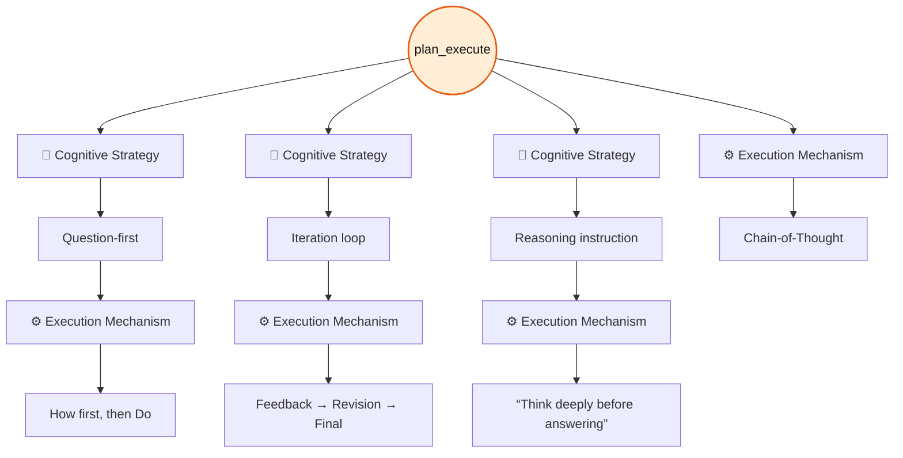
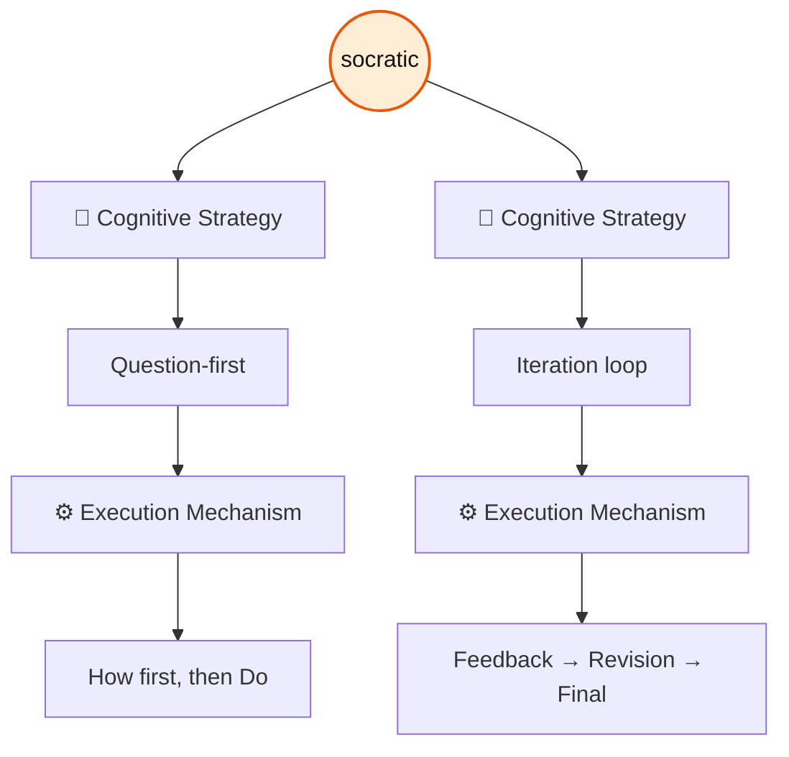
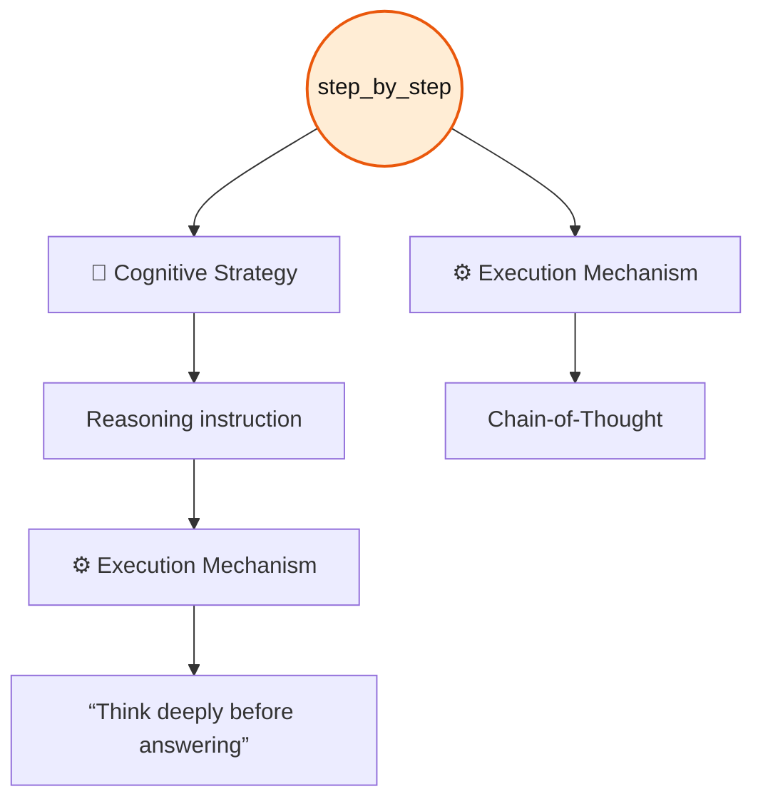
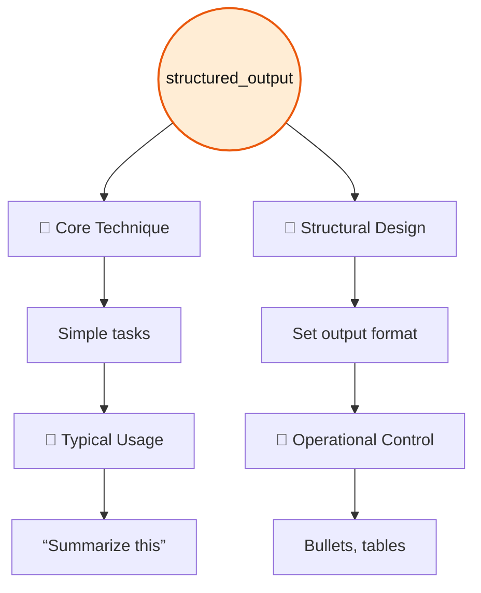
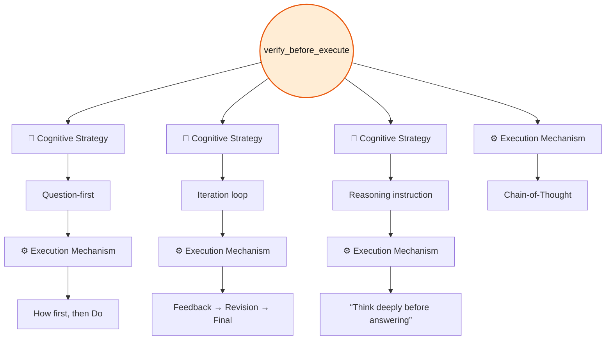

# Default Patterns

> [!NOTE]
> Table columns that follow **Pattern** represent matches with corresponding elements in [The Iceberg Of Prompting](../../the_iceberg_of_prompting.md) framework.

## Pattern: `plan_execute`

### Description

This pattern instructs the model to first outline a concise sequence of steps required to solve a task and then carry out those steps in order. By separating planning from execution, it improves clarity, organization, and reliability in the final result.

### Specification Table

| Pattern               | 🧠 Cognitive Strategy | ⚙️ Execution Mechanism          |
|-----------------------|-----------------------|---------------------------------|
| plan_execute          | Question-first        | How first, then Do              |
| plan_execute          | Iteration loop        | Feedback → Revision → Final     |
| plan_execute          | Reasoning instruction | “Think deeply before answering” |
| plan_execute          | —                     | Chain-of-Thought                |

### Flowchart



### Usage

#### Agent Configuration

```yaml
patterns:
  - plan_execute
```

#### With Compose

```bash
pp compose --role <role> --task <task> --pattern plan_execute --var input="<input>"
```

### Example

```bash
pp compose \
  --role executor \
  --task compose_action \
  --pattern verify_before_execute \
  --pattern plan_execute \
  --pattern structured_output \
  --var action="Make a shopping list" \
  --var context="I am at the computer store" \
  --var examples="|Item |Brand |Price | |Mouse |Genius |$45.75 |"
```

## Pattern: `socratic`

### Description

Encourages the model to guide reasoning through reflective questioning before presenting a final answer, prompting the user to examine assumptions, clarify thinking, and progressively arrive at a well-supported conclusion.

### Specification Table

| Pattern | 🧠 Cognitive Strategy | ⚙️ Execution Mechanism      |
|---------|-----------------------|-----------------------------|
|socratic | Question-first        | How first, then Do          |
|socratic | Iteration loop        | Feedback → Revision → Final |

### Flowchart



### Usage

#### Agent Configuration

```yaml
patterns:
  - socratic
```

#### With Compose

```bash
pp compose --role <role> --task <task> --pattern socratic --var input="<input>"
```

### Example

```bash
pp compose \
  --role tutor \
  --task explain \
  --pattern socratic \
  --var input="Random text"
```

## Pattern: `step_by_step`

### Description

Guides the agent to structure its reasoning as a sequence of clearly numbered steps, making each stage of the thought process explicit and logically connected. This pattern emphasizes transparency in problem-solving by revealing intermediate reasoning and ensuring that no logical transitions are omitted between steps.

### Specification Table

| Pattern     | 🧠 Cognitive Strategy | ⚙️ Execution Mechanism           |
|-------------|-----------------------|----------------------------------|
|step_by_step | Reasoning instruction | “Think deeply before answering”  |
|step_by_step | —                     | Chain-of-Thought                 |

### Flowchart



### Usage

#### Agent Configuration

```yaml
patterns:
  - step_by-step
```

#### With Compose

```bash
pp compose --role <role> --task <task> --pattern step_by_step --var input="<input>"
```

### Example

```bash
pp compose \
  --role tutor \
  --task explain \
  --pattern step_by_step \
  --var input="Boolean algebra simplification"
```

## Pattern: `structured_output`

### Description

A formatting pattern that instructs the model to organize its response in a clear, readable structure. The output should be divided into labeled sections, use bullet points to present information concisely, and conclude with a brief summary. The goal is to improve clarity and scanability while avoiding unnecessary verbosity.

### Specification Table

| Pattern           | 🧩 Core Technique     | 🎯 Typical Usage                |
|-------------------|-----------------------|---------------------------------|
| structured_output |Simple tasks           |“Summarize this”                 |

| Pattern           | 📐 Structural Design  | 🚦 Operational Control          |
|-------------------|-----------------------|---------------------------------|
| structured_output |Set output format      |Bullets, tables                  |

### Flowchart



### Usage

#### Agent Configuration

```yaml
patterns:
  - structured_output
```

#### With Compose

```bash
pp compose --role <role> --task <task> --pattern structured_output --var input="<input>"
```

### Example

```bash
pp compose \
  --role executor \
  --task compose_action \
  --pattern verify_before_execute \
  --pattern plan_execute \
  --pattern structured_output \
  --var action="Make a shopping list" \
  --var context="I am at the computer store" \
  --var examples="|Item |Brand |Price | |Mouse |Genius |$45.75 |"
```

## Pattern: `verify_before_execute`

### Description

Ensures that all necessary information is present and clear before performing an action. If essential inputs are missing or ambiguous, the process pauses and identifies what is required instead of continuing with incomplete data. This prevents errors, incorrect assumptions, and unintended outcomes by confirming readiness prior to execution.

### Specification Table

| Pattern               | 🧠 Cognitive Strategy | ⚙️ Execution Mechanism          |
|-----------------------|-----------------------|---------------------------------|
| verify_before_execute | Question-first        | How first, then Do              |
| verify_before_execute | Iteration loop        | Feedback → Revision → Final     |
| verify_before_execute | Reasoning instruction | “Think deeply before answering” |
| verify_before_execute | —                     | Chain-of-Thought                |

### Flowchart



### Usage

#### Agent Configuration

```yaml
patterns:
  - verify_before_execute
```

#### With Compose

```bash
pp compose --role <role> --task <task> --pattern verify_before_execute --var input="<input>"
```

### Example

```bash
pp compose \
  --role executor \
  --task compose_action \
  --pattern verify_before_execute \
  --pattern plan_execute \
  --pattern structured_output \
  --var action="Make a shopping list" \
  --var context="I am at the computer store" \
  --var examples="|Item |Brand |Price | |Mouse |Genius |$45.75 |"
```
