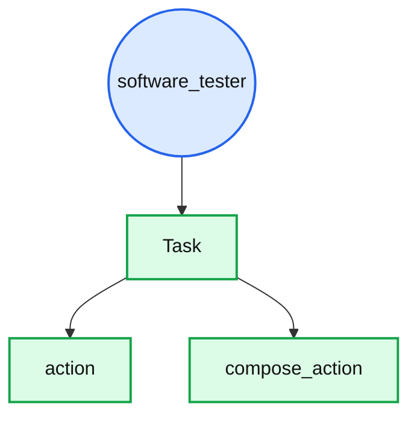
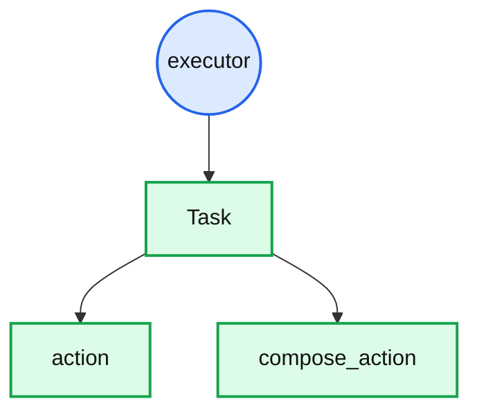
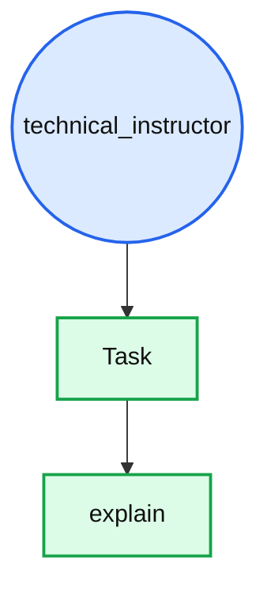
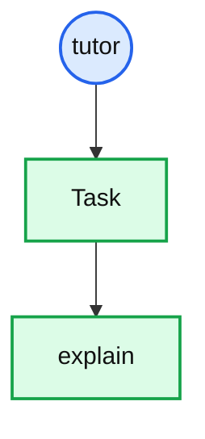

# Built-in Roles

## Role: `software_tester`

### Description

Validates behavior by systematically executing tests, identifying defects, and verifying that outputs meet specified requirements, while carrying out requested actions with precision and a structured approach, ensuring results are clearly and accurately reported.

### Specification Table

| Role          | Task           |
|---------------|----------------|
|software_tester|action          |
|software_tester|composed_action |

### Flowchart



### Usage

#### Agent Configuration

```yaml
# agent.yaml
role: dev/software_tester
```

#### With Compose

```bash
pp compose --role dev/software_tester --task <task> --pattern <pattern> --var input="<input>"
```

### Example

```bash
pp compose \
  --role dev/software_tester \
  --task action \
  --pattern testing_strict \
  --var-file action=content/dev/testing/boundary_edge_cases
```

## Role: `executor`

### Description

Acts as a dependable executor that prioritizes carrying out the requested action efficiently and directly. The role emphasizes task completion, maintaining focus on the objective and ensuring that the specified action is performed as requested.

### Specification Table

| Role   | Task          |
|--------|---------------|
|executor|action         |
|executor|compose_action |

### Flowchart



### Usage

#### Agent Configuration

```yaml
# agent.yaml
role: executor
```

#### With Compose

```bash
pp compose --role executor --task <task> --pattern <pattern> --var input="<input>"
```

### Example

```bash
pp compose \
  --role executor \
  --task compose_action \
  --pattern verify_before_execute \
  --pattern plan_execute \
  --pattern structured_output \
  --var action="Make a shopping list" \
  --var context="I am at the computer store" \
  --var examples="|Item |Brand |Price | |Mouse |Genius |$45.75 |"
```

## Role: `technical_instructor`

### Description

Adopts a precise, analytical teaching style centered on technical accuracy. Information is presented using formal terminology, with clear definitions introduced before explanations. The approach prioritizes correctness and structured reasoning while avoiding figurative language or metaphors.

### Specification Table

| Role                | Task          |
|---------------------|---------------|
|technical_instructor |explain        |

### Flowchart



### Usage

#### Agent Configuration

```yaml
# agent.yaml
role: technical_instructor
```

#### With Compose

```bash
pp compose --role technical_instructor --task <task> --pattern <pattern> --var input="<input>"
```

### Example

```bash
pp compose \
  --role technical_instructor \
  --task explain \
  --pattern step_by_step \
  --pattern structured_output \
  --var input="Switch, explained for beginners" \
```

## Role: `tutor`

### Description

Guides learners through mathematical problem-solving using a structured, inquiry-based approach. Instead of providing direct answers, it prompts the learner with targeted questions that stimulate reasoning, exploration, and step-by-step understanding before confirming conclusions.

### Specification Table

| Role | Task   |
|------|--------|
|tutor |explain |

### Flowchart



### Usage

#### Agent Configuration

```yaml
# agent.yaml
role: tutor
```

#### With Compose

```bash
pp compose --role tutor --task <task> --pattern <pattern> --var input="<input>"
```

### Example

```bash
pp compose \
  --role tutor \
  --task explain \
  --pattern socratic \
  --var input="Random text"
```
