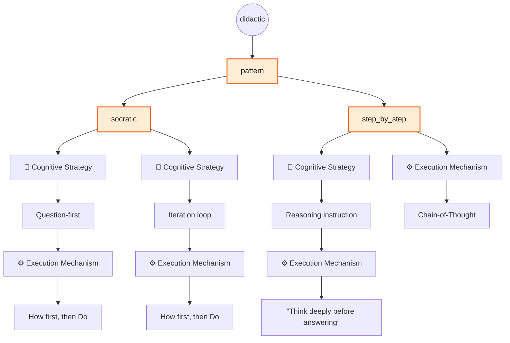
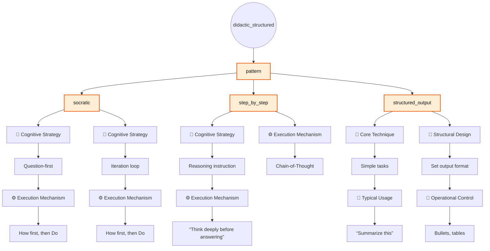

# Default Pattern Groups

> [!NOTE]
> Table columns that follow **Pattern** represent matches with corresponding elements in [The Iceberg Of Prompting](../../the_iceberg_of_prompting.md) framework.

## Pattern Group: `didactic`

### Description

Expands into the patterns `socratic` and `step_by_step`.

### Usage

```bash
pp compose --role <role> --task <task> --pattern didactic --var input="<input>"
```

### Example

```bash
pp compose --role tutor --task explain --pattern didactic --var input="Binary Search Trees" --copy
```

### Specification Table

| Pattern | 🧠 Cognitive Strategy | ⚙️ Execution Mechanism      |
|---------|-----------------------|-----------------------------|
|socratic | Question-first        | How first, then Do          |
|socratic | Iteration loop        | Feedback → Revision → Final |

| Pattern     | 🧠 Cognitive Strategy | ⚙️ Execution Mechanism           |
|-------------|-----------------------|----------------------------------|
|step_by_step | Reasoning instruction | “Think deeply before answering”  |
|step_by_step | —                     | Chain-of-Thought                 |

### Flowchart



## Pattern Group: `didactic_structured`

### Description

Expands into the patterns `socratic`, `step_by_step`, and `structured_output`.

### Usage

```bash
pp compose --role <role> --task <task> --pattern didactic_structured --var input="<input>"
```

### Example

```bash
pp compose --role tutor --task explain --pattern didactic_structured --var input="Binary Search Trees" --copy
```

### Specification Table

| Pattern | 🧠 Cognitive Strategy | ⚙️ Execution Mechanism      |
|---------|-----------------------|-----------------------------|
|socratic | Question-first        | How first, then Do          |
|socratic | Iteration loop        | Feedback → Revision → Final |

| Pattern     | 🧠 Cognitive Strategy | ⚙️ Execution Mechanism           |
|-------------|-----------------------|----------------------------------|
|step_by_step | Reasoning instruction | “Think deeply before answering”  |
|step_by_step | —                     | Chain-of-Thought                 |

| Pattern           | 🧩 Core Technique     | 🎯 Typical Usage                |
|-------------------|-----------------------|---------------------------------|
| structured_output |Simple tasks           |“Summarize this”                 |

| Pattern           | 📐 Structural Design  | 🚦 Operational Control          |
|-------------------|-----------------------|---------------------------------|
| structured_output |Set output format      |Bullets, tables                  |

### Flowchart


